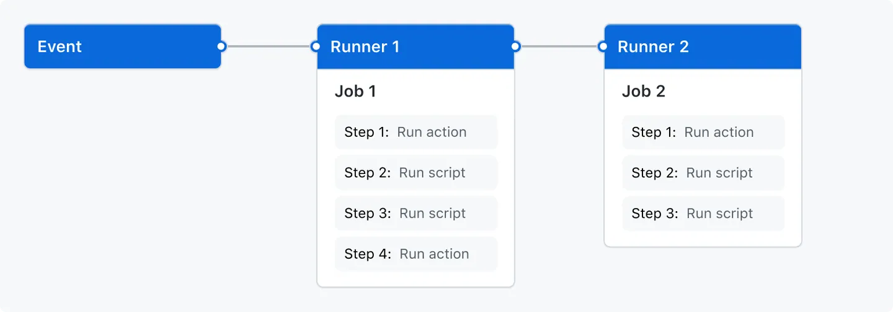
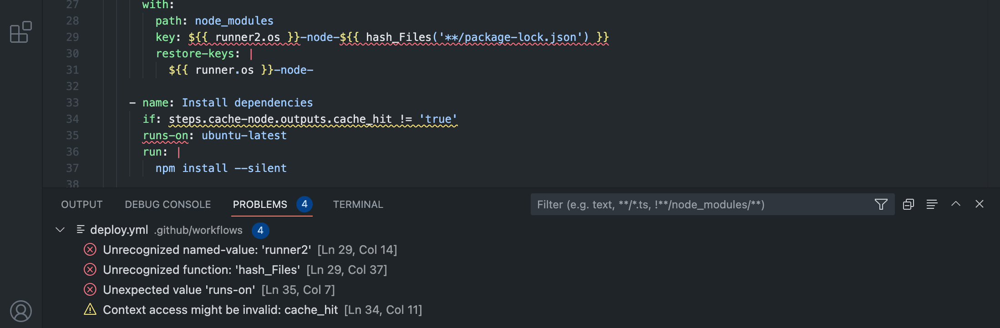

# GitHub Actions Overview

This document is a high-level overview of GitHub Actions. It is not intended to be a comprehensive guide to the platform, but rather a starting point for understanding the basics.

## Intro to Concepts

There are a few concepts that are important to understand when working with GitHub Actions.

### Definitions

Some basic definitions to get us started...



#### [Workflow](https://docs.github.com/en/actions/about-github-actions/understanding-github-actions#workflows)

A workflow is a configurable automated process that will run one or more jobs. Workflows are defined by a YAML file checked in to your repository in the `.github/workflows` directory. A repository can have multiple workflows, each of which can perform a different set of tasks.

#### [Events](https://docs.github.com/en/actions/about-github-actions/understanding-github-actions#events)

An event is a specific activity in a repository that triggers a workflow run. It could be triggered by an event in your repository, or they can be triggered manually, or at a defined schedule.

#### [Jobs](https://docs.github.com/en/actions/about-github-actions/understanding-github-actions#jobs)

A job is a set of steps in a workflow that is executed on the same runner. Each step is either a shell script that will be executed, or an action that will be run. Steps are executed in order and are dependent on each other. Since each step is executed on the same runner, you can share data from one step to another.

#### [Steps / Actions](https://docs.github.com/en/actions/about-github-actions/understanding-github-actions#actions)

A step can be a script that will be executed or a GitHub action.

#### [Runners](https://docs.github.com/en/actions/about-github-actions/understanding-github-actions#runners)

A runner is a server that runs your workflows when they're triggered. Each runner can run a single job at a time.

* GHR: GitHub-Hosted Runner
* SHR: Self-Hosted Runner

### Action: Marketplace Action, Custom Actions (Composite Action)

An action is a custom application for the GitHub Actions platform that performs a complex but frequently repeated task. Use an action to help reduce the amount of repetitive code that you write in your workflow files. 

An action can pull your git repository from GitHub, set up the correct toolchain for your build environment, or set up the authentication to your cloud provider.

You can write your own actions, or you can find actions to use in your workflows in the [GitHub Marketplace](https://github.com/marketplace?type=actions).

For more information, see [Creating actions](https://docs.github.com/en/actions/creating-actions).

### Runner: GitHub-Hosted Runner vs. Self-Hosted Runner

You can run your jobs on GitHub Hosted compute or you can host your own Self Hosted runners.

The standard runners GitHub offers are:
* `ubuntu-latest`
* `windows-latest`
* `macos-latest` 

There are also [Larger runners](https://docs.github.com/en/actions/using-github-hosted-runners/about-larger-runners/about-larger-runners#specifications-for-general-larger-runners)" for more demanding use cases.

#### Cost

Actions running on standard GitHub-hosted runners are free for public repositories and self-hosted runners are free for all repositories.

For private repositories, GitHub charges based on a [per-minute rate](https://docs.github.com/en/billing/managing-billing-for-github-actions/about-billing-for-github-actions#per-minute-rates). The cost is simply the number of minutes your job runs multiplied by the per-minute rate.

> [!TIP]
> GitHub always rounds up the time that a job runs to the nearest minute. For example, if your job runs for 61 seconds, GitHub will charge you for 2 minutes.

* [About Larger Runners](https://docs.github.com/en/actions/using-github-hosted-runners/about-larger-runners)

### Autoscaling with self-hosted runners (ARC)

You can automatically increase or decrease the number of self-hosted runners in your environment in response to the webhook events you receive with a particular label.

* [Autoscaling with self-hosted runners](https://docs.github.com/en/actions/hosting-your-own-runners/managing-self-hosted-runners/autoscaling-with-self-hosted-runners)
* [actions-runner-controller](https://github.com/actions/actions-runner-controller)

<!-- ## GitHub Actions Ethos

### Essence/Opinionation

### Traceability

### Reusability (DRY)

### Ephemerality

### Extensibility: Do Anything You Want

### Easy to Get Started

## How to Author Workflow Files -->

### The Developer Loop: Writing, Testing, Debugging

Writing a workflow file is as simple as creating a `.yml` file in the `.github/workflows` directory of your repository.

To test your workflow file you will push it to your repository and navigate to the Actions tab to see the status of your workflow run.

When the workflow run is complete you can view the logs of each step to see what happened.

### GitHub CLI

The GitHub CLI brings GitHub to the terminal. It's also preinstalled on all GitHub runners!

If you need to quickly perform a GitHub task this is the easiest way to do it!

<details>
  <summary>Comment on an issue</summary>

```yml
on:
  issues:
    types:
      - opened
jobs:
  comment:
    runs-on: ubuntu-latest
    steps:
      - run: gh issue comment $ISSUE --body "Thank you for opening this issue!"
        env:
          GH_TOKEN: ${{ secrets.GITHUB_TOKEN }}
          ISSUE: ${{ github.event.issue.html_url }}
```
</details>

For the list of available extensions for the gh cli, see the topic [`gh-extension`](https://github.com/topics/gh-extension).

[Install](https://cli.github.com/)
[Manual](https://cli.github.com/manual/)
[Using GitHub CLI in workflows](https://docs.github.com/en/actions/writing-workflows/choosing-what-your-workflow-does/using-github-cli-in-workflows)

### VS Code extension

There is a VS Code extension that provides syntax highlighting, intellisense, and more! This is a must have when authoring workflows.

[GitHub Actions Extension](https://marketplace.visualstudio.com/items?itemName=GitHub.vscode-github-actions)



### Copilot

GitHub Copilot is an AI pair programmer that helps you write code faster and with less effort. It can be incredibly useful when writing GitHub Actions workflows. Leverage the completion or chat feature to get help with writing your workflows.

[GitHub Copilot](https://copilot.github.com/)

### Actions Loves JavaScript

One of the most popular languages for writing actions is JavaScript. This is because it is easy to get started with and has a lot of community support.

#### GitHub Actions ToolKit

The GitHub Actions ToolKit provides a set of packages to make creating actions easier.

* [Actions Toolkit](https://github.com/actions/toolkit?tab=readme-ov-file#readme)
* [Creating a JavaScript action](https://docs.github.com/en/actions/creating-actions/creating-a-javascript-action)

### Github-script

This action makes it easy to quickly write a script in your workflow that uses the GitHub API and the workflow run context. The GitHub Actions Toolkit is pre-installed and available for use in the script you write.

<details>
  <summary>Welcome a first-time contributor</summary>

```yml
on: pull_request_target

jobs:
  welcome:
    runs-on: ubuntu-latest
    steps:
      - uses: actions/github-script@v7
        with:
          script: |
            // Get a list of all issues created by the PR opener
            // See: https://octokit.github.io/rest.js/#pagination
            const creator = context.payload.sender.login
            const opts = github.rest.issues.listForRepo.endpoint.merge({
              ...context.issue,
              creator,
              state: 'all'
            })
            const issues = await github.paginate(opts)

            for (const issue of issues) {
              if (issue.number === context.issue.number) {
                continue
              }

              if (issue.pull_request) {
                return // Creator is already a contributor.
              }
            }

            await github.rest.issues.createComment({
              issue_number: context.issue.number,
              owner: context.repo.owner,
              repo: context.repo.repo,
              body: `**Welcome**, new contributor!

                Please make sure you've read our [contributing guide](CONTRIBUTING.md) and we look forward to reviewing your Pull request shortly ✨`
            })
```
</details>

<details>
  <summary>Download data from a URL</summary>

```yml
on: pull_request

jobs:
  diff:
    runs-on: ubuntu-latest
    steps:
      - uses: actions/github-script@v7
        with:
          script: |
            const diff_url = context.payload.pull_request.diff_url
            const result = await github.request(diff_url)
            console.log(result)
```
</details>

### Expressions

You can use expressions to programmatically set environment variables in workflow files and access contexts. An expression can be any combination of literal values, references to a context, or functions. You can combine literals, context references, and functions using operators. For more information about contexts, see "Contexts."

[Expressions](https://docs.github.com/en/actions/writing-workflows/choosing-what-your-workflow-does/expressions)

## How to Trigger/Initiate Workflow Runs

You can configure your workflows to run when specific activity on GitHub happens, at a scheduled time, or when an event outside of GitHub occurs.

* [Events that trigger workflows](https://docs.github.com/en/actions/writing-workflows/choosing-when-your-workflow-runs/events-that-trigger-workflows)

<!-- ### Summary of Event Grid That Triggers Workflows -->

### Configuring Input (Activity Types): Conditionally Trigger

### Event: Workflow Dispatch

Workflows triggered by `workflow_dispatch` and `workflow_call` access their inputs using the inputs context.

For workflows triggered by `workflow_dispatch` inputs are available in the `github.event.inputs`. 

<details>
  <summary>Example of on.workflow_dispatch.inputs</summary>

```yml
on:
  workflow_dispatch:
    inputs:
      logLevel:
        description: 'Log level'
        required: true
        default: 'warning'
        type: choice
        options:
        - info
        - warning
        - debug
      tags:
        description: 'Test scenario tags'
        required: false
        type: boolean
      environment:
        description: 'Environment to run tests against'
        type: environment
        required: true

jobs:
  log-the-inputs:
    runs-on: ubuntu-latest
    steps:
      - run: |
          echo "Log level: $LEVEL"
          echo "Tags: $TAGS"
          echo "Environment: $ENVIRONMENT"
        env:
          LEVEL: ${{ inputs.logLevel }}
          TAGS: ${{ inputs.tags }}
          ENVIRONMENT: ${{ inputs.environment }}
```
</details>

* [`workflow_dispatch` event](https://docs.github.com/en/actions/writing-workflows/choosing-when-your-workflow-runs/events-that-trigger-workflows#workflow_dispatch)
* [`inputs` context](https://docs.github.com/en/actions/writing-workflows/choosing-what-your-workflow-does/contexts#inputs-context)

### Event: Workflow Call
Workflows triggered by `workflow_call` access their inputs using the `inputs` context.

<details>
  <summary>Example of on.workflow_call.outputs</summary>

```yml
on:
  workflow_call:
    # Map the workflow outputs to job outputs
    outputs:
      workflow_output1:
        description: "The first job output"
        value: ${{ jobs.my_job.outputs.job_output1 }}
      workflow_output2:
        description: "The second job output"
        value: ${{ jobs.my_job.outputs.job_output2 }}
```
</details>

* [`workflow_call` event](https://docs.github.com/en/actions/writing-workflows/choosing-when-your-workflow-runs/events-that-trigger-workflows#workflow_call)
* [`inputs` context](https://docs.github.com/en/actions/writing-workflows/choosing-what-your-workflow-does/contexts#inputs-context)

### Event: Workflow Run

The `workflow_run` event allows you to execute a workflow based on execution or completion of another workflow.

<details>
  <summary>Running a workflow based on the conclusion of another workflow</summary>

```yml
on:
  workflow_run:
    workflows: [Build]
    types: [completed]

jobs:
  on-success:
    runs-on: ubuntu-latest
    if: ${{ github.event.workflow_run.conclusion == 'success' }}
    steps:
      - run: echo 'The triggering workflow passed'
  on-failure:
    runs-on: ubuntu-latest
    if: ${{ github.event.workflow_run.conclusion == 'failure' }}
    steps:
      - run: echo 'The triggering workflow failed'
```
</details>

### Event: Schedule

The `schedule` event allows you to trigger a workflow at a scheduled time.

<details>
  <summary>Running a workflow on a schedule</summary>

```yml
on:
  schedule:
    # * is a special character in YAML so you have to quote this string
            ┌───────────── minute (0 - 59)
            │ ┌───────────── hour (0 - 23)
            │ │ ┌───────────── day of the month (1 - 31)
            │ │ │ ┌───────────── month (1 - 12 or JAN-DEC)
            │ │ │ │ ┌───────────── day of the week (0 - 6 or SUN-SAT)
            │ │ │ │ │
            │ │ │ │ │
            │ │ │ │ │
    - cron: * * * * *
```
</details>

### Non-Core CI/CD Use Cases


### Concurrency: Order of Workflow Runs Based on When Trigger Happened

### Re-running Workflows

## How to Structure/Manage Jobs in the Workflow

### Understanding the 1:1 Job-to-Runner Mapping

### Parallelization of Jobs

### Linking Jobs

### Matrices

### Job Timeouts

### Sharing Artifacts Between Jobs

### Running Jobs in Containers / Service Containers

### Environments: Controls How/When a Job is Run Based on Protection Rules Set, Limits Branches, Scopes Secrets

### Conditional Jobs/Steps

### Permissions for Jobs

There is a default token called `GITHUB_TOKEN`.

[Assigning permissions to jobs](https://docs.github.com/en/actions/writing-workflows/choosing-what-your-workflow-does/assigning-permissions-to-jobs)

## How to Use and Create Actions (Marketplace)

### What is an Action?

Actions are the building blocks that power your workflow. A workflow can contain one or more actions, either as individual steps or as part of an action group. An action is a reusable unit of code that can be used in multiple workflows. You can create your own actions, use actions created by the GitHub community, or use a combination of both.

* [GitHub Actions Marketplace](https://github.com/marketplace?type=actions)

### Types of Actions

Javascript actions are the most popular and easiest to get started with, Docker containers package the environment with the GitHub Actions code, and Composite actions are a way to reuse actions in a more modular way.

There are three types of custom actions:
* [JavaScript](https://docs.github.com/en/actions/creating-actions/creating-a-javascript-action)
* [Docker](https://docs.github.com/en/actions/creating-actions/creating-a-docker-container-action) (Not available on macOS or Windows runners)
* [Composite](https://docs.github.com/en/actions/creating-actions/creating-a-composite-run-steps-action)
* [About custom actions](https://docs.github.com/en/actions/creating-actions/about-custom-actions)

### Securing Usage of Actions

* [Security hardening for GitHub Actions](https://docs.github.com/en/actions/security-for-github-actions/security-guides/security-hardening-for-github-actions)

### Creating Your Own Actions

You can create your own actions to use in your workflows. This is a great way to encapsulate logic that you want to reuse across multiple workflows.

* [Creating actions](https://docs.github.com/en/actions/creating-actions)

### Cool Actions to Look Out For: github-script, Anything by GitHub, Major Cloud Providers, Terraform, Docker

Here are some popular actions to get you started:

* [GitHub Script](https://github.com/actions/github-script)
* [Awesome Actions](https://github.com/sdras/awesome-actions#readme)
* [GitHub Authored Actions](https://github.com/marketplace?query=publisher%3Aactions)
* [Azure Actions](https://github.com/marketplace?query=publisher%3Aazure)
* [AWS Actions](https://github.com/marketplace?query=publisher%3Aaws-actions)
* [GCP Actions](https://github.com/marketplace?query=publisher%3Agoogle-github-actions)
* [Build and Push Docker Images](https://github.com/marketplace/actions/build-and-push-docker-images)

## How to Organize, Share, and Scale Workflows

### Reusable Workflows (and Outputs)

### Composite Actions

### Required Workflows (per Repo Rulesets)

### Starter Workflows

### Managing Updates to Workflows/Actions

### Monorepo vs Polyrepo

## How to Manage Artifacts / Caching

### Artifact Attestations

### Retention Period

### Sharing Artifacts Between Jobs

### Caching Dependencies

### Caching Limits

### Rotating Cache

## How to Create and Manage Secrets

### GitHub Secret Store (libsodium)

### Org-Level, Repo-Level, and Env-Level Secrets (Scope)

### Scoping/Limiting Secrets

### OIDC Access to Cloud Environments

### Reusable Workflows and Secrets

### Redacting Secrets

### Integrating with 3rd Party Key Vaults/HSMs

## How to Create and Manage Runners

### Based on Azure and Ephemeral

### Types and Sizes of Runners (and OSes)

### GHRs vs SHRs

### ARC: Actions Runtime Configuration

### Runner Groups

### Managed Runner GHR Images and Custom GHR Images

### GHR Networking

### Static IPs

### VNET Injection (Azure Private Networking)

### API Gateways

### Wireguard

### Runner Labels

### Auto-scaling and Scale Limits

## How to Govern Usage

### Repository Rulesets

### Push Rulesets: Control Who Can Push Changes

### Branch Rulesets

### Environment Protection Rules: Custom Gating

### Allow List for Marketplace Actions

### Spending Limits and Budgets/Cost Centers (BvN)

### Actions Policies

### Allow List for Marketplace Actions

### Enable/Disable Actions

### Audit Log

### Status Checks

## How to Observe What’s Going on with CI/CD

### Actions Usage Metrics

### Job Summaries

### Alerting/Notifications: Finished, Failed

### 3rd Party Tools: DataDog, Trunk, etc.

### Stats on Runner Utilization

### Workflow Run History

### Pinning and Searching Workflows

### Logging

## How to Manage Cost and Billing

### Pricing

### Entitlements

### Billing Page in GitHub (Soon to be BvN)

### CSV Usage Download and GitHub Usage Report Viewer

### Invoicing

### Paying Through GitHub vs MSFT Azure

## How to Migrate

### Importer

### VS Code Extension + Copilot

## Understanding Platform Limits

### Concurrency Limit

### API Rate Limits

### Reusable Workflow Limit

### Workflow Run Time

### Job Execution Time

### Matrix Size

### Cache Size per Repo

### Queue Limit

### Artifact and Log Retention

### Exception Process

[Usage Limits, Billing, and Administration Documentation](https://docs.github.com/en/actions/administering-github-actions/usage-limits-billing-and-administration)
